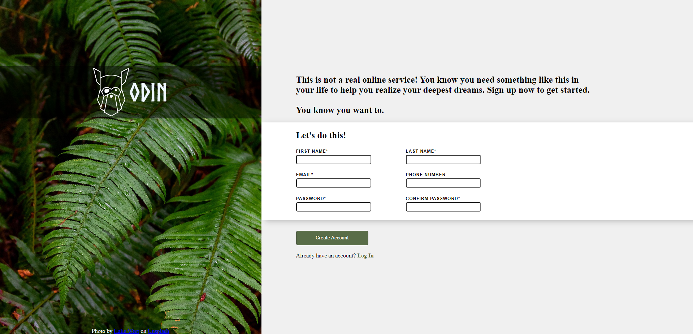

# Sign-Up-Form

Live Demo:
https://leo-tsant.github.io/Sign-Up-Form/

## Overview

This project was created for the [Sign-up Form assignment](https://www.theodinproject.com/lessons/foundations-rock-paper-scissors) as part of [The Odin Project](https://www.theodinproject.com/). Built using HTML, CSS, and JavaScript, this project demonstrates form handling, validation, and responsive design. It provides a clean and user-friendly interface for users to enter their information.
